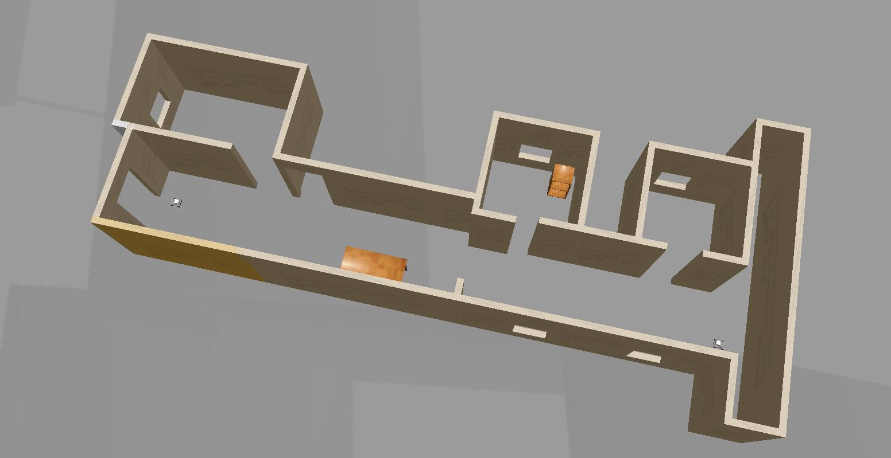
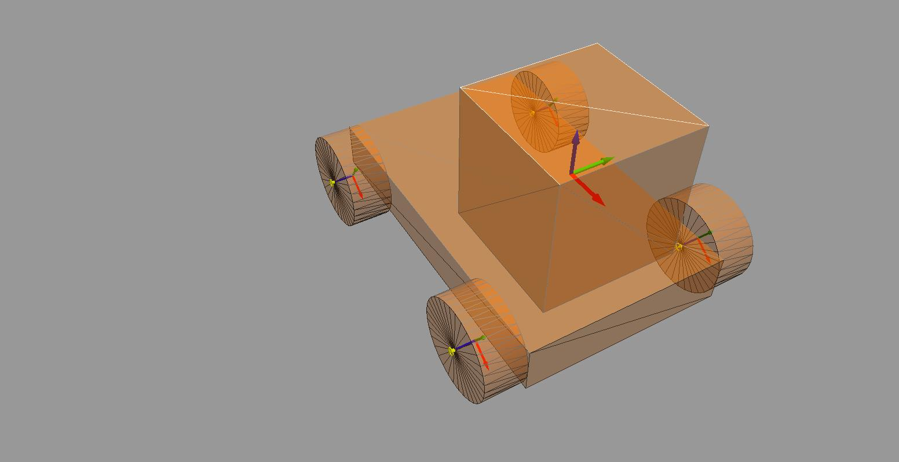

# Robotic-Nano-Degree-Project-1

## Description

This is the first Project of Udacity Robotics Nano Degree

## Prerequistes

- Udacity Robond virtual machine running on VMWare Player

## Building

```shell
# Clonning the Repo
git clone git@github.com:RemonComputer/Robotic-Nano-Degree-Project-1.git 
cd Robotic-Nano-Degree-Project-1/
mkdir build
cd build/
cmake ..
cmake --build .
```

## Running

```shell
# go to project folder
cd ..
export GAZEBO_PLUGIN_PATH=$(pwd)/build:${GAZEBO_PLUGIN_PATH}
gazebo world/my_world.sdf
```

## What to expect

- The world plugin is printing `Welcome to Remon's World`.
- The world contains a small appartment with two instance of a robotic car model.

## Screenshots




